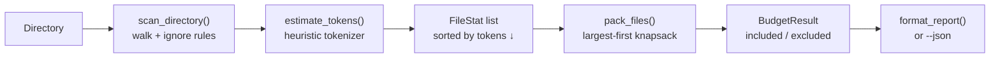

# ctx-budget

**Will your codebase fit in the model's context window? Find out before you pay for it.**

`ctx-budget` scans a directory, estimates tokens per file with an offline
heuristic tokenizer (no model, no API key, no network), and packs files
largest-first into a context budget — so agent developers know exactly what
fits, what's cut, and which files are the biggest offenders.

## Why

Every agent loop starts the same way: stuff the repo into the prompt and hope.
`ctx-budget` turns that hope into a number. It answers three questions in one
command:

1. How many tokens is this directory, really?
2. What fits in a 200k (or 32k, or 1M) window after reserving output space?
3. Which files should I summarize, chunk, or exclude first?

## Install

```bash
git clone https://github.com/sulaimanvesal/ctx-budget.git
cd ctx-budget
pip install -r requirements.txt
```

Python 3.9+. Zero runtime dependencies.

## Usage

```bash
# Text report for a 200k window (default), reserving 8k for output
python -m ctx_budget.cli /path/to/your/repo

# Custom window, reserve, and force README in first
python -m ctx_budget.cli /path/to/repo --window 128000 --reserve 4096 \
    --must-include README.md

# Machine-readable output for CI / agent tooling
python -m ctx_budget.cli /path/to/repo --json
```

Example output:

```
Context window : 200,000 tokens
Reserved output: 8,192 tokens
Usable budget  : 191,808 tokens
Scanned total  : 12,340 tokens
Packed         : 12,340 tokens (6.4% of budget), 14 files in / 0 out

Included (largest first):
     3,120  src/agent.py
     1,845  src/tools.py
       ...

Excluded (biggest offenders):
       ...
```

The JSON mode is designed to be consumed by agents themselves — a coding agent
can call `ctx-budget --json` to budget its own file reads before opening them.

## Architecture



### Components

| Module | Role |
|---|---|
| `ctx_budget/tokenizer.py` | Offline token estimator: ~1 token / 4 chars, discounted for whitespace density and long identifier runs. Calibrated to land within ~15% of `cl100k-base` counts on typical code/prose. |
| `ctx_budget/scan.py` | Recursive directory walk. Skips VCS dirs, `node_modules`, `__pycache__`, build outputs, and binary extensions; reports skipped files separately. |
| `ctx_budget/budget.py` | Greedy largest-first packing under `window − reserve`. `must_include` paths pack first. Renders the text report. |
| `ctx_budget/cli.py` | CLI: `--window`, `--reserve`, `--must-include`, `--json`. |

## The estimator, honestly

Real tokenizers (BPE) need the model's vocabulary, so an offline tool can't be
exact. `estimate_tokens()` uses the well-known ~4-chars-per-token rule with
two corrections:

- **Whitespace discount** — tokenizers compress runs of whitespace efficiently.
- **Long-run bonus** — identifiers, numbers, and base64-ish blobs compress
  better than the 4-char rule predicts.

Sanity target: ±15% of `tiktoken`'s `cl100k-base` on typical English and code.
Use it for budgeting, not billing.

## Tests

```bash
pytest -q
```

Covers the estimator's scaling/monotonicity, the scanner's ignore rules and
sorting, and the packer's greedy behavior, `must_include` priority, and error
paths.

## Demo (no API keys)

```bash
python demo.py
```

Budgets this repo itself for a 200k window — pure local computation.

## License

MIT — see [LICENSE](LICENSE).
